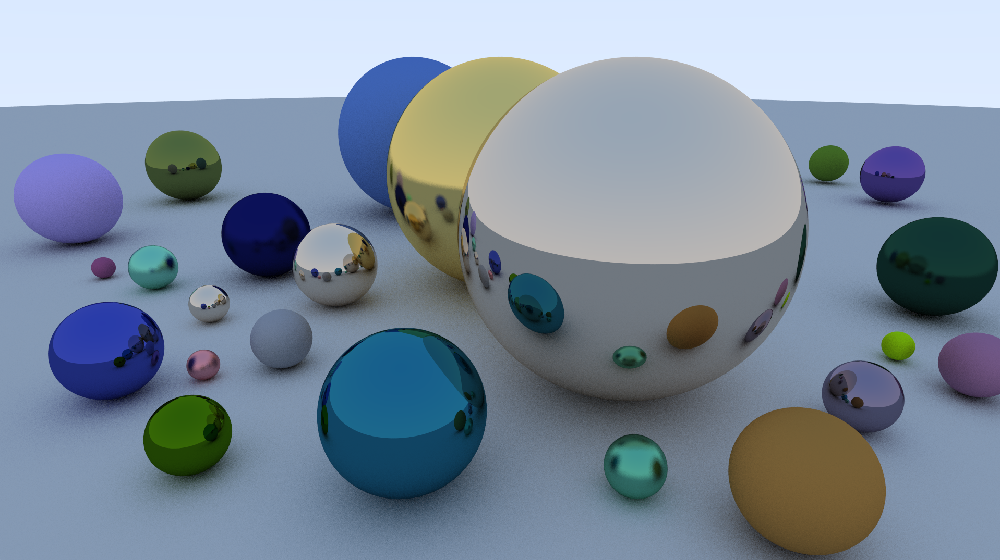

# Welcome to my Basic RayTracer in C++

This project is my attempt to implement a **RayTracer in C++**. The main goal here was to use my C++ knowledge on a medium scale project with a lot of room for **optimization architecture improvement and features ideas**. The only external lib used is **SDL2** that is required to run the project. As of January 2020 I **paused this project** to clean the Codebase in this *"V1.0"* state and focus on other things after 3 weeks on it. There is a lot of other features in the future. Those will be listed at the bottom of this documentation.

## Disclaimer

As this project is still a **Work in Pogress** the codebase still have debugg function, commentary, and few architecture / coding issue. Regarding my mindset behind it, the target was not performance (real-time rendering and movement is not the goal), but the render quality. Rendering a full scene in 1080p takes around 15min and this will probably go higher when future features are implemented. Moreover this RayTracer has is default scene hard-written and in the current state is not a tool where you can create and test your own objects.

> **Note:** SDL2 is also required to run the RayTracer and the project was not tested on a Linux envrionnement.

## Abstract

## How to Run

To run this program :

- Clone this repository `git clone https://github.com/Nrechati/RayTracer.git`
- Just `make`
- `./RayTracer` to run

>**Note**: Program was built on macOS Mojave and I know there is some workaround to do to compile on Linux as well.

## Classes

- Window
	- Constructor
	- Description

- Vector
	- Constructor
	- Description

- Camera
	- Constructor
	- Description

- A_Object
	- Constructor
	- Description

- Ray
	- Constructor
	- Description

- Sphere
	- Constructor
	- Description

- A_Material
	- Constructor
	- Description

- Color
	- Constructor
	- Description

- ProgressBar
	- Constructor
	- Description

> **Note :** Naming convention is `A_` prefix is for abstract class and `I_` is for interfaces

## Features

## Features to ne implemented

- Soon to be implemented
	- Targeting Object on mouse pointer to move/change them
	- Adding Dielectrics materials for glass and water.

- Later implemented features
	- Motion Blur
	- Volume Hierarchy
	- Texture & texture Mapping
	- Perlin Noise texture
	- Rectangle and Lights
	- Volumes

## Current TODO list *(last Update : 01/15/2020)*:

-	V1.0 codebase cleaning :
	- Split files
	- Cleaner calculus for reading
	- Leak on materials
	- Leak on Camera
	- Remove Global in main nicely
	- Remove C type cast

