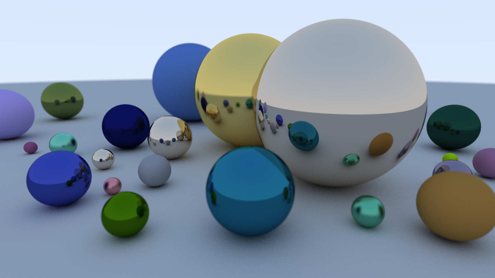

# RayTracer
RayTracer C++ implemention

#TODO:

-	CodeBase :
	- Split files
	- Cleaner calculus for reading
	- Leak on materials
	- Leak on Camera
	- Remove Global in main nicely
	- Remove C type cast

-	Feature :
	- Soon :
		- Target object to move/change it
		- Dielectrics Materials
	- Later :
		- Motion Blur
		- Volume Hierarchy
		- Texture & texture Mapping
		- Perlin Noise texture
		- Rectangle and Lights
		- Volumes
